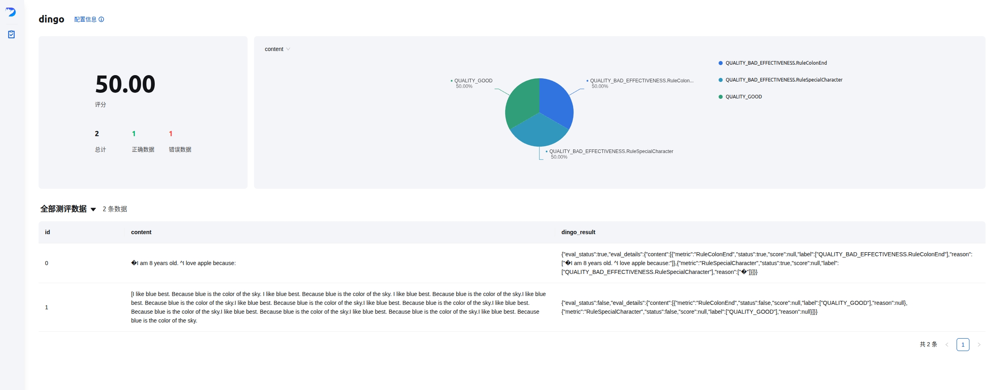

<!-- SEO Meta Information and Structured Data -->
<div itemscope itemtype="https://schema.org/SoftwareApplication" align="center" xmlns="http://www.w3.org/1999/html">
  <meta itemprop="name" content="Dingo: A Comprehensive AI Data Quality Evaluation Tool">
  <meta itemprop="description" content="Comprehensive AI-powered data quality assessment platform for machine learning datasets, LLM training data validation, hallucination detection, and RAG system evaluation">
  <meta itemprop="applicationCategory" content="Data Quality Software">
  <meta itemprop="operatingSystem" content="Cross-platform">
  <meta itemprop="programmingLanguage" content="Python">
  <meta itemprop="url" content="https://github.com/MigoXLab/dingo">
  <meta itemprop="downloadUrl" content="https://pypi.org/project/dingo-python/">
  <meta itemprop="softwareVersion" content="latest">
  <meta itemprop="license" content="Apache-2.0">

<!-- logo -->
<p align="center">
  
</p>

<!-- badges -->
<p align="center">
  <a href="https://github.com/pre-commit/pre-commit"></a>
  <a href="https://pypi.org/project/dingo-python/"></a>
  <a href="https://pypi.org/project/dingo-python/"></a>
  <a href="https://github.com/DataEval/dingo/blob/main/LICENSE"></a>
  <a href="https://github.com/DataEval/dingo/stargazers"></a>
  <a href="https://github.com/DataEval/dingo/network/members"></a>
  <a href="https://github.com/DataEval/dingo/issues"></a>
  <a href="https://mseep.ai/app/dataeval-dingo"></a>
  <a href="https://deepwiki.com/MigoXLab/dingo"></a>
  <a href="https://archestra.ai/mcp-catalog/dataeval__dingo"></a>
</p>

</div>


<div align="center">

[English](README.md) · [简体中文](README_zh-CN.md) · [日本語](README_ja.md)

</div>


<!-- join us -->

<p align="center">
    👋 join us on <a href="https://discord.gg/Jhgb2eKWh8" target="_blank">Discord</a> and <a href="./docs/assets/wechat.jpg" target="_blank">WeChat</a>
</p>


<p align="center">
  If you like Dingo, please give us a ⭐ on GitHub!
  <br/>
  <a href="https://github.com/DataEval/dingo/stargazers" target="_blank">
    
  </a>
</p>


# Introduction

**Dingo is A Comprehensive AI Data, Model and Application Quality Evaluation Tool**, designed for ML practitioners, data engineers, and AI researchers. It helps you systematically assess and improve the quality of training data, fine-tuning datasets, and production AI systems.

---

## 🚀 Enterprise Dingo SaaS Version

Need a **production-grade data quality platform**? Try [Dingo SaaS](https://github.com/MigoXLab/dingo-saas) Enterprise Edition!

### ✨ Compared to the open-source version, SaaS provides:

- 🌐 **Web UI** - Visual evaluation interface, no coding required
- 🔐 **Access Control** - JWT + Google OAuth 2.0
- 📊 **Visual Reports** - Interactive charts, trend analysis, export features
- 🔌 **RESTful API** - Seamless integration with existing systems

### 📝 How to Get Free SaaS Code

👉 **[Apply for Dingo SaaS Repository Access](https://aicarrier.feishu.cn/share/base/form/shrcn9RqYttByQ5H1np6Yrnmhuf)** 

Review time: 1-5 business days | Suitable for enterprise data governance, team collaboration

---

## Why Dingo?

🎯 **Production-Grade Quality Checks** - From pre-training datasets to RAG systems, ensure your AI gets high-quality data

🗄️ **Multi-Source Data Integration** - Seamlessly connect to Local files, SQL databases (PostgreSQL/MySQL/SQLite), HuggingFace datasets, and S3 storage

🔍 **Multi-Field Evaluation** - Apply different quality rules to different fields in parallel (e.g., ISBN validation for `isbn`, text quality for `title`)

🤖 **RAG System Assessment** - Comprehensive evaluation of retrieval and generation quality with 5 academic-backed metrics

🧠 **LLM & Rule & Agent Hybrid** - Combine fast heuristic rules (30+ built-in) with LLM-based deep assessment

🚀 **Flexible Execution** - Run locally for rapid iteration or scale with Spark for billion-scale datasets

📊 **Rich Reporting** - Detailed quality reports with GUI visualization and field-level insights

## Architecture Diagram


# Quick Start

## Installation

```shell
pip install dingo-python
```

## Example Use Cases of Dingo

### 1. Evaluate LLM chat data

```python
from dingo.config.input_args import EvaluatorLLMArgs
from dingo.io.input import Data
from dingo.model.llm.text_quality.llm_text_quality_v4 import LLMTextQualityV4
from dingo.model.rule.rule_common import RuleEnterAndSpace

data = Data(
    data_id='123',
    prompt="hello, introduce the world",
    content="Hello! The world is a vast and diverse place, full of wonders, cultures, and incredible natural beauty."
)


def llm():
    LLMTextQualityV4.dynamic_config = EvaluatorLLMArgs(
        key='YOUR_API_KEY',
        api_url='https://api.openai.com/v1/chat/completions',
        model='gpt-4o',
    )
    res = LLMTextQualityV4.eval(data)
    print(res)


def rule():
    res = RuleEnterAndSpace().eval(data)
    print(res)
```

### 2. Evaluate Dataset

```python
from dingo.config import InputArgs
from dingo.exec import Executor

# Evaluate a dataset from Hugging Face
input_data = {
    "input_path": "tatsu-lab/alpaca",  # Dataset from Hugging Face
    "dataset": {
        "source": "hugging_face",
        "format": "plaintext"  # Format: plaintext
    },
    "executor": {
        "result_save": {
            "bad": True  # Save evaluation results
        }
    },
    "evaluator": [
        {
            "evals": [
                {"name": "RuleColonEnd"},
                {"name": "RuleSpecialCharacter"}
            ]
        }
    ]
}

input_args = InputArgs(**input_data)
executor = Executor.exec_map["local"](input_args)
result = executor.execute()
print(result)
```

## Command Line Interface

### Evaluate with Rule Sets

```shell
python -m dingo.run.cli --input test/env/local_plaintext.json
```

### Evaluate with LLM (e.g., GPT-4o)

```shell
python -m dingo.run.cli --input test/env/local_json.json
```

## GUI Visualization

After evaluation (with `result_save.bad=True`), a frontend page will be automatically generated. To manually start the frontend:

```shell
python -m dingo.run.vsl --input output_directory
```

Where `output_directory` contains the evaluation results with a `summary.json` file.



## Online Demo
Try Dingo on our online demo: [(Hugging Face)🤗](https://huggingface.co/spaces/DataEval/dingo)

## Local Demo
Try Dingo in local:

```shell
cd app_gradio
python app.py
```


## Google Colab Demo
Experience Dingo interactively with Google Colab notebook: [](https://colab.research.google.com/github/DataEval/dingo/blob/dev/examples/colab/dingo_colab_demo.ipynb)


# MCP Server

Dingo includes an experimental Model Context Protocol (MCP) server. For details on running the server and integrating it with clients like Cursor, please see the dedicated documentation:

[English](README_mcp.md) · [简体中文](README_mcp_zh-CN.md) · [日本語](README_mcp_ja.md)

## Video Demonstration

To help you get started quickly with Dingo MCP, we've created a video walkthrough:

https://github.com/user-attachments/assets/aca26f4c-3f2e-445e-9ef9-9331c4d7a37b

This video demonstrates step-by-step how to use Dingo MCP server with Cursor.


# 🎓 Key Concepts for Practitioners

## What Makes Dingo Production-Ready?

### 1. **Multi-Field Evaluation Pipeline**
Apply different quality checks to different fields in a single pass:
```python
"evaluator": [
    {"fields": {"content": "isbn"}, "evals": [{"name": "RuleIsbn"}]},
    {"fields": {"content": "title"}, "evals": [{"name": "RuleAbnormalChar"}]},
    {"fields": {"content": "description"}, "evals": [{"name": "LLMTextQualityV5"}]}
]
```
**Why It Matters**: Evaluate structured data (like database tables) without writing separate scripts for each field.

### 2. **Stream Processing for Large Datasets**
SQL datasources use SQLAlchemy's server-side cursors:
```python
# Handles billions of rows without OOM
for data in dataset.get_data():  # Yields one row at a time
    result = evaluator.eval(data)
```
**Why It Matters**: Process production databases without exporting to intermediate files.

### 3. **Field Isolation in Memory**
RAG evaluations prevent context bleeding across different field combinations:
```
outputs/
├── user_input,response,retrieved_contexts/  # Faithfulness group
└── user_input,response/                     # Answer Relevancy group
```
**Why It Matters**: Accurate metric calculations when evaluating multiple field combinations.

### 4. **Hybrid Rule-LLM Strategy**
Combine fast rules (100% coverage) with sampled LLM checks (10% coverage):
```python
"evals": [
    {"name": "RuleAbnormalChar"},        # Fast, runs on all data
    {"name": "LLMTextQualityV5"}         # Expensive, sample if needed
]
```
**Why It Matters**: Balance cost and coverage for production-scale evaluation.

### 5. **Extensibility Through Registration**
Clean plugin architecture for custom rules, prompts, and models:
```python
@Model.rule_register('QUALITY_BAD_CUSTOM', ['default'])
class MyCustomRule(BaseRule):
    @classmethod
    def eval(cls, input_data: Data) -> EvalDetail:
        # Example: check if content is empty
        if not input_data.content:
            return EvalDetail(
                metric=cls.__name__,
                status=True,  # Found an issue
                label=[f'{cls.metric_type}.{cls.__name__}'],
                reason=["Content is empty"]
            )
        return EvalDetail(
            metric=cls.__name__,
            status=False,  # No issue found
            label=['QUALITY_GOOD']
        )
```
**Why It Matters**: Adapt to domain-specific requirements without forking the codebase.

---

# 📚 Data Quality Metrics

Dingo provides **70+ evaluation metrics** across multiple dimensions, combining rule-based speed with LLM-based depth.

## Metric Categories

| Category | Examples | Use Case |
|----------|----------|----------|
| **Pretrain Text Quality** | Completeness, Effectiveness, Similarity, Security | LLM pre-training data filtering |
| **SFT Data Quality** | Honest, Helpful, Harmless (3H) | Instruction fine-tuning data |
| **RAG Evaluation** | Faithfulness, Context Precision, Answer Relevancy | RAG system assessment |
| **Hallucination Detection** | HHEM-2.1-Open, Factuality Check | Production AI reliability |
| **Classification** | Topic categorization, Content labeling | Data organization |
| **Multimodal** | Image-text relevance, VLM quality, OCR visual evaluation | Vision-language data |
| **Security** | PII detection, Perspective API toxicity | Privacy and safety |

📊 **[View Complete Metrics Documentation →](docs/metrics.md)**  
📖 **[RAG Evaluation Guide →](docs/rag_evaluation_metrics.md)** | **[中文版](docs/rag_evaluation_metrics_zh.md)**  
🔍 **[Hallucination Detection Guide →](docs/hallucination_detection_guide.md)** | **[中文版](docs/hallucination_guide.md)**  
✅ **[Factuality Assessment Guide →](docs/factuality_assessment_guide.md)** | **[中文版](docs/factcheck_guide.md)**  
👁️ **[VLM Render Judge Guide →](docs/en/vlm_render_judge_guide.md)** | **[中文版](docs/vlm_render_judge_guide.md)**

Most metrics are backed by academic research to ensure scientific rigor.

## Quick Metric Usage

```python
llm_config = {
    "model": "gpt-4o",
    "key": "YOUR_API_KEY",
    "api_url": "https://api.openai.com/v1/chat/completions"
}

input_data = {
    "evaluator": [
        {
            "fields": {"content": "content"},
            "evals": [
                {"name": "RuleAbnormalChar"},           # Rule-based (fast)
                {"name": "LLMTextQualityV5", "config": llm_config}  # LLM-based (deep)
            ]
        }
    ]
}
```

**Customization**: All prompts are defined in `dingo/model/llm/` directory (organized by category: `text_quality/`, `rag/`, `hhh/`, etc.). Extend or modify them for domain-specific requirements.


# 🌟 Feature Highlights

## 📊 Multi-Source Data Integration

**Diverse Data Sources** - Connect to where your data lives  
✅ **Local Files**: JSONL, CSV, TXT, Parquet  
✅ **SQL Databases**: PostgreSQL, MySQL, SQLite, Oracle, SQL Server (with stream processing)  
✅ **Cloud Storage**: S3 and S3-compatible storage  
✅ **ML Platforms**: Direct HuggingFace datasets integration

**Enterprise-Ready SQL Support** - Production database integration  
✅ Memory-efficient streaming for billion-scale datasets  
✅ Connection pooling and automatic resource cleanup  
✅ Complex SQL queries (JOIN, WHERE, aggregations)  
✅ Multiple dialect support with SQLAlchemy

**Multi-Field Quality Checks** - Different rules for different fields  
✅ Parallel evaluation pipelines (e.g., ISBN validation + text quality simultaneously)  
✅ Field aliasing and nested field extraction (`user.profile.name`)  
✅ Independent result reports per field  
✅ ETL pipeline architecture for flexible data transformation

---

## 🤖 RAG System Evaluation

**5 Academic-Backed Metrics** - Based on RAGAS, DeepEval, TruLens research  
✅ **Faithfulness**: Answer-context consistency (hallucination detection)  
✅ **Answer Relevancy**: Answer-query alignment  
✅ **Context Precision**: Retrieval precision  
✅ **Context Recall**: Retrieval recall  
✅ **Context Relevancy**: Context-query relevance

**Comprehensive Reporting** - Auto-aggregated statistics  
✅ Average, min, max, standard deviation for each metric  
✅ Field-grouped results  
✅ Batch and single evaluation modes

📖 **[View RAG Evaluation Guide →](docs/rag_evaluation_metrics_zh.md)**

---

## 🧠 Hybrid Evaluation System

**Rule-Based** - Fast, deterministic, cost-effective  
✅ 30+ built-in rules (text quality, format, PII detection)  
✅ Regex, heuristics, statistical checks  
✅ Custom rule registration

**LLM-Based** - Deep semantic understanding  
✅ OpenAI (GPT-4o, GPT-3.5), DeepSeek, Kimi  
✅ Local models (Llama3, Qwen)  
✅ Vision-Language Models (InternVL, Gemini)  
✅ Custom prompt registration

**Agent-Based** - Multi-step reasoning with tools
✅ Web search integration (Tavily)
✅ Adaptive context gathering
✅ Multi-source fact verification
✅ Custom agent & tool registration

**Extensible Architecture**  
✅ Plugin-based rule/prompt/model registration  
✅ Clean separation of concerns (agents, tools, orchestration)  
✅ Domain-specific customization

---

## 🚀 Flexible Execution & Integration

**Multiple Interfaces**  
✅ CLI for quick checks  
✅ Python SDK for integration  
✅ MCP (Model Context Protocol) server for IDEs (Cursor, etc.)

**Scalable Execution**  
✅ Local executor for rapid iteration  
✅ Spark executor for distributed processing  
✅ Configurable concurrency and batching

**Data Sources**  
✅ **Local Files**: JSONL, CSV, TXT, Parquet formats  
✅ **Hugging Face**: Direct integration with HF datasets hub  
✅ **S3 Storage**: AWS S3 and S3-compatible storage  
✅ **SQL Databases**: PostgreSQL, MySQL, SQLite, Oracle, SQL Server (stream processing for large-scale data)

**Modalities**  
✅ Text (chat, documents, code)  
✅ Images (with VLM support)  
✅ Multimodal (text + image consistency)

---

## 📈 Rich Reporting & Visualization

**Multi-Level Reports**  
✅ Summary JSON with overall scores  
✅ Field-level breakdown  
✅ Per-rule violation details  
✅ Type and name distribution

**GUI Visualization**  
✅ Built-in web interface  
✅ Interactive data exploration  
✅ Anomaly tracking

**Metric Aggregation**  
✅ Automatic statistics (avg, min, max, std_dev)  
✅ Field-grouped metrics  
✅ Overall quality score

---

# 📖 User Guide

## 🔧 Extensibility

Dingo uses a clean plugin architecture for domain-specific customization:

### Custom Rule Registration

```python
from dingo.model import Model
from dingo.model.rule.base import BaseRule
from dingo.io import Data
from dingo.io.output.eval_detail import EvalDetail

@Model.rule_register('QUALITY_BAD_CUSTOM', ['default'])
class DomainSpecificRule(BaseRule):
    """Check domain-specific patterns"""

    @classmethod
    def eval(cls, input_data: Data) -> EvalDetail:
        text = input_data.content

        # Your custom logic
        is_valid = your_validation_logic(text)

        return EvalDetail(
            metric=cls.__name__,
            status=not is_valid,  # False = good, True = bad
            label=['QUALITY_GOOD' if is_valid else 'QUALITY_BAD_CUSTOM'],
            reason=["Validation details..."]
        )
```

### Custom LLM/Prompt Registration

```python
from dingo.model import Model
from dingo.model.llm.base_openai import BaseOpenAI

@Model.llm_register('custom_evaluator')
class CustomEvaluator(BaseOpenAI):
    """Custom LLM evaluator with specialized prompts"""

    _metric_info = {
        "metric_name": "CustomEvaluator",
        "metric_type": "LLM-Based Quality",
        "category": "Custom Category"
    }

    prompt = """Your custom prompt here..."""
```

**Examples:**
- [Custom Rules](examples/register/sdk_register_rule.py)
- [Custom Models](examples/register/sdk_register_llm.py)

### Agent-Based Evaluation with Tools

Dingo supports agent-based evaluators that can use external tools for multi-step reasoning and adaptive context gathering. Two implementation patterns are available:

**Pattern 1: LangChain-Based** (e.g., `AgentFactCheck`)
- Framework-driven with autonomous multi-step reasoning
- Uses LangChain 1.0's `create_agent` with ReAct pattern
- Best for: Complex reasoning tasks, rapid prototyping
- Less code, more declarative

**Pattern 2: Custom Workflow** (e.g., `AgentHallucination`)
- Developer-driven with explicit workflow control
- Manual tool calls and LLM interactions
- Best for: Composing existing evaluators, domain-specific workflows
- Full control, explicit behavior

Both patterns share the same configuration interface and are transparent to users.

**Built-in Agents:**
- `AgentFactCheck`: LangChain-based fact-checking with autonomous search control
- `AgentHallucination`: Custom workflow hallucination detection with adaptive context gathering
- `ArticleFactChecker`: Two-phase article fact-checking — extracts verifiable claims then verifies each in parallel using web search and Arxiv, with configurable concurrency control

**Quick Example:**

```python
from dingo.io import Data
from dingo.io.output.eval_detail import EvalDetail
from dingo.model import Model
from dingo.model.llm.agent.base_agent import BaseAgent

@Model.llm_register('MyAgent')
class MyAgent(BaseAgent):
    """Custom agent with tool support"""

    available_tools = ["tavily_search", "my_custom_tool"]
    max_iterations = 5

    @classmethod
    def eval(cls, input_data: Data) -> EvalDetail:
        # Use tools for fact-checking
        search_result = cls.execute_tool('tavily_search', query=input_data.content)

        # Multi-step reasoning with LLM
        result = cls.send_messages([...])

        return EvalDetail(...)
```

For detailed guidance on choosing and implementing agent patterns, see [Agent Development Guide](docs/agent_development_guide.md).

**Configuration Example:**
```json
{
  "evaluator": [{
    "evals": [{
      "name": "AgentHallucination",
      "config": {
        "key": "openai-api-key",
        "model": "gpt-4",
        "parameters": {
          "agent_config": {
            "max_iterations": 5,
            "tools": {
              "tavily_search": {"api_key": "tavily-key"}
            }
          }
        }
      }
    }]
  }]
}
```

**Learn More:**
- [Agent Development Guide](docs/agent_development_guide.md) - Comprehensive guide for creating custom agents and tools
- [AgentHallucination Example](examples/agent/agent_hallucination_example.py) - Production agent example
- [AgentFactCheck Example](examples/agent/agent_executor_example.py) - LangChain agent example
- [ArticleFactChecker Example](examples/agent/agent_article_fact_checking_example.py) - Article-scale two-phase fact verification

## ⚙️ Execution Modes

### Local Executor (Development & Small-Scale)

```python
from dingo.config import InputArgs
from dingo.exec import Executor

input_args = InputArgs(**input_data)
executor = Executor.exec_map["local"](input_args)
result = executor.execute()

# Access results
summary = executor.get_summary()           # Overall metrics
bad_data = executor.get_bad_info_list()    # Quality issues
good_data = executor.get_good_info_list()  # High-quality data
```

**Best For**: Rapid iteration, debugging, datasets < 100K rows

### Spark Executor (Production & Large-Scale)

```python
from pyspark.sql import SparkSession
from dingo.exec import Executor

spark = SparkSession.builder.appName("Dingo").getOrCreate()
spark_rdd = spark.sparkContext.parallelize(your_data)

executor = Executor.exec_map["spark"](
    input_args,
    spark_session=spark,
    spark_rdd=spark_rdd
)
result = executor.execute()
```

**Best For**: Production pipelines, distributed processing, datasets > 1M rows

## Evaluation Reports

After evaluation, Dingo generates:

1. **Summary Report** (`summary.json`): Overall metrics and scores
2. **Detailed Reports**: Specific issues for each rule violation

Report Description:
1. **score**: `num_good` / `total`
2. **type_ratio**: The count of type / total, such as: `QUALITY_BAD_COMPLETENESS` / `total`

Example summary:
```json
{
    "task_id": "d6c922ec-981c-11ef-b723-7c10c9512fac",
    "task_name": "dingo",
    "eval_group": "default",
    "input_path": "test/data/test_local_jsonl.jsonl",
    "output_path": "outputs/d6c921ac-981c-11ef-b723-7c10c9512fac",
    "create_time": "20241101_144510",
    "score": 50.0,
    "num_good": 1,
    "num_bad": 1,
    "total": 2,
    "type_ratio": {
        "content": {
            "QUALITY_BAD_COMPLETENESS.RuleColonEnd": 0.5,
            "QUALITY_BAD_RELEVANCE.RuleSpecialCharacter": 0.5
        }
    }
}
```

# 🚀 Roadmap & Contributions

## Future Plans

- [ ] **Agent-as-a-Judge** - Multi-agent debate patterns for bias reduction and complex reasoning
- [ ] **SaaS Platform** - Hosted evaluation service with API access and dashboard
- [ ] **Audio & Video Modalities** - Extend beyond text/image
- [ ] **Diversity Metrics** - Statistical diversity assessment
- [ ] **Real-time Monitoring** - Continuous quality checks in production pipelines

## Limitations

The current built-in detection rules and model methods primarily focus on common data quality issues. For special evaluation needs, we recommend customizing detection rules.

# Acknowledgments

- [RedPajama-Data](https://github.com/togethercomputer/RedPajama-Data)
- [mlflow](https://github.com/mlflow/mlflow)
- [deepeval](https://github.com/confident-ai/deepeval)
- [ragas](https://github.com/explodinggradients/ragas)

# Contribution

We appreciate all the contributors for their efforts to improve and enhance `Dingo`. Please refer to the [Contribution Guide](docs/en/CONTRIBUTING.md) for guidance on contributing to the project.

# License

This project uses the [Apache 2.0 Open Source License](LICENSE).

This project uses fasttext for some functionality including language detection. fasttext is licensed under the MIT License, which is compatible with our Apache 2.0 license and provides flexibility for various usage scenarios.

# Citation

If you find this project useful, please consider citing our tool:

```
@misc{dingo,
  title={Dingo: A Comprehensive AI Data Quality Evaluation Tool for Large Models},
  author={Dingo Contributors},
  howpublished={\url{https://github.com/MigoXLab/dingo}},
  year={2024}
}
```
