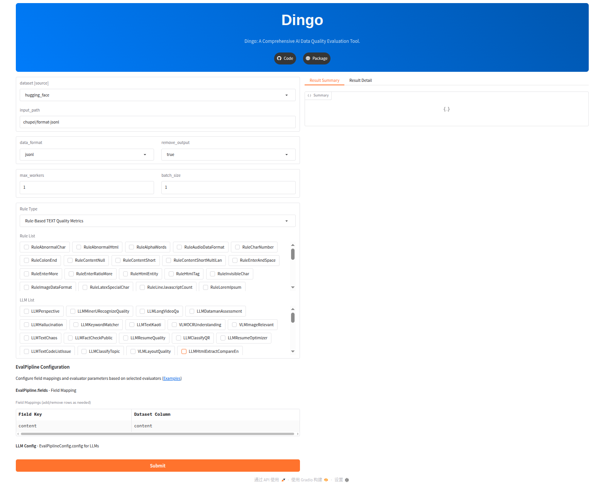

<!-- SEO メタ情報と構造化データ -->
<div itemscope itemtype="https://schema.org/SoftwareApplication" align="center" xmlns="http://www.w3.org/1999/html">
  <meta itemprop="name" content="Dingo: AI データ品質評価ツール">
  <meta itemprop="description" content="機械学習データセット、LLM学習データ検証、幻覚検出、RAGシステム評価のための包括的なAI駆動データ品質評価プラットフォーム">
  <meta itemprop="applicationCategory" content="データ品質ソフトウェア">
  <meta itemprop="operatingSystem" content="クロスプラットフォーム">
  <meta itemprop="programmingLanguage" content="Python">
  <meta itemprop="url" content="https://github.com/MigoXLab/dingo">
  <meta itemprop="downloadUrl" content="https://pypi.org/project/dingo-python/">
  <meta itemprop="softwareVersion" content="latest">
  <meta itemprop="license" content="Apache-2.0">

<!-- logo -->
<p align="center">
  
</p>

<!-- badges -->
<p align="center">
  <a href="https://github.com/pre-commit/pre-commit"></a>
  <a href="https://pypi.org/project/dingo-python/"></a>
  <a href="https://pypi.org/project/dingo-python/"></a>
  <a href="https://github.com/DataEval/dingo/blob/main/LICENSE"></a>
  <a href="https://github.com/DataEval/dingo/stargazers"></a>
  <a href="https://github.com/DataEval/dingo/network/members"></a>
  <a href="https://github.com/DataEval/dingo/issues"></a>
  <a href="https://mseep.ai/app/dataeval-dingo"></a>
  <a href="https://deepwiki.com/MigoXLab/dingo"></a>
  <a href="https://archestra.ai/mcp-catalog/dataeval__dingo"></a>
</p>

</div>


<div align="center">

[English](README.md) · [简体中文](README_zh-CN.md) · [日本語](README_ja.md)

</div>


<!-- join us -->

<p align="center">
    👋 <a href="https://discord.gg/Jhgb2eKWh8" target="_blank">Discord</a>と<a href="./docs/assets/wechat.jpg" target="_blank">WeChat</a>でご参加ください
</p>

<p align="center">
  このプロジェクトが役に立ったら、GitHubで⭐を付けてください！
  <br/>
  <a href="https://github.com/DataEval/dingo/stargazers" target="_blank">
    
  </a>
</p>


# はじめに

**Dingo は包括的な AI データ、モデル、アプリケーション品質評価ツール**であり、機械学習エンジニア、データエンジニア、AI 研究者向けに設計されています。トレーニングデータ、ファインチューニングデータセット、本番 AI システムの品質を体系的に評価・改善するのを支援します。

## なぜ Dingo を選ぶのか？

🎯 **本番グレードの品質チェック** - 事前学習データセットから RAG システムまで、AI に高品質なデータを提供

🗄️ **マルチソースデータ統合** - ローカルファイル、SQL データベース（PostgreSQL/MySQL/SQLite）、HuggingFace データセット、S3 ストレージへのシームレスな接続

🔍 **マルチフィールド評価** - 異なるフィールドに並行して異なる品質ルールを適用（例：`isbn` フィールドには ISBN 検証、`title` フィールドにはテキスト品質チェック）

🤖 **RAG システム評価** - 5つの学術的裏付けのある指標で検索と生成品質を包括的に評価

🧠 **LLM とルールのハイブリッド** - 高速ヒューリスティックルール（30以上の組み込みルール）と LLM ベースの深度評価を組み合わせ

🚀 **柔軟な実行** - ローカルで実行して迅速に反復、または Spark で数十億規模のデータセットにスケール

📊 **豊富なレポート** - GUI 可視化とフィールドレベルの洞察を備えた詳細な品質レポート

## アーキテクチャ図


# クイックスタート

## インストール

```shell
pip install dingo-python
```

## 使用例

### 1. LLMチャットデータの評価

```python
from dingo.config.input_args import EvaluatorLLMArgs
from dingo.io.input import Data
from dingo.model.llm.text_quality.llm_text_quality_v4 import LLMTextQualityV4
from dingo.model.rule.rule_common import RuleEnterAndSpace

data = Data(
    data_id='123',
    prompt="hello, introduce the world",
    content="Hello! The world is a vast and diverse place, full of wonders, cultures, and incredible natural beauty."
)


def llm():
    LLMTextQualityV4.dynamic_config = EvaluatorLLMArgs(
        key='YOUR_API_KEY',
        api_url='https://api.openai.com/v1/chat/completions',
        model='gpt-4o',
    )
    res = LLMTextQualityV4.eval(data)
    print(res)


def rule():
    res = RuleEnterAndSpace().eval(data)
    print(res)
```

### 2. データセットの評価

```python
from dingo.config import InputArgs
from dingo.exec import Executor

# Hugging Faceからデータセットを評価
input_data = {
    "input_path": "tatsu-lab/alpaca",  # Hugging Faceからのデータセット
    "dataset": {
        "source": "hugging_face",
        "format": "plaintext"  # フォーマット: plaintext
    },
    "executor": {
        "result_save": {
            "bad": True  # 評価結果を保存
        }
    },
    "evaluator": [
        {
            "evals": [
                {"name": "RuleColonEnd"},
                {"name": "RuleSpecialCharacter"}
            ]
        }
    ]
}

input_args = InputArgs(**input_data)
executor = Executor.exec_map["local"](input_args)
result = executor.execute()
print(result)
```

## コマンドラインインターフェース

### ルールセットでの評価

```shell
python -m dingo.run.cli --input test/env/local_plaintext.json
```

### LLM（例：GPT-4o）での評価

```shell
python -m dingo.run.cli --input test/env/local_json.json
```

## GUI可視化

評価後（`result_save.bad=True`で）、フロントエンドページが自動的に生成されます。手動でフロントエンドを開始するには：

```shell
python -m dingo.run.vsl --input output_directory
```

ここで`output_directory`は`summary.json`ファイルを含む評価結果が格納されているディレクトリです。


## オンラインデモ
オンラインデモでDingoをお試しください: [(Hugging Face)🤗](https://huggingface.co/spaces/DataEval/dingo)

## ローカルデモ
地元でDingoを試してみましょう：

```shell
cd app_gradio
python app.py
```



## Google Colabデモ
Google ColabノートブックでDingoをインタラクティブに体験してください：[](https://colab.research.google.com/github/DataEval/dingo/blob/dev/examples/colab/dingo_colab_demo.ipynb)


# MCPサーバー

Dingoには実験的なModel Context Protocol（MCP）サーバーが含まれています。サーバーの実行とCursorなどのクライアントとの統合の詳細については、専用のドキュメントをご覧ください：

[English](README_mcp.md) · [简体中文](README_mcp_zh-CN.md) · [日本語](README_mcp_ja.md)

## ビデオデモンストレーション

Dingo MCPを素早く始められるよう、ビデオウォークスルーを作成しました：

https://github.com/user-attachments/assets/aca26f4c-3f2e-445e-9ef9-9331c4d7a37b

このビデオでは、Dingo MCPサーバーをCursorと一緒に使用する方法をステップバイステップで説明しています。


# 🎓 実務者のための重要概念

## Dingo を本番環境で使用できる理由

### 1. **マルチフィールド評価パイプライン**
1回の実行で異なるフィールドに異なる品質チェックを適用：
```python
"evaluator": [
    {"fields": {"content": "isbn"}, "evals": [{"name": "RuleIsbn"}]},
    {"fields": {"content": "title"}, "evals": [{"name": "RuleAbnormalChar"}]},
    {"fields": {"content": "description"}, "evals": [{"name": "LLMTextQualityV5"}]}
]
```
**重要性**：各フィールドごとに別々のスクリプトを書かずに構造化データ（データベーステーブルなど）を評価できます。

### 2. **大規模データセットのストリーミング処理**
SQL データソースは SQLAlchemy のサーバーサイドカーソルを使用：
```python
# メモリオーバーフローなしで数十億行を処理
for data in dataset.get_data():  # 1行ずつyield
    result = evaluator.eval(data)
```
**重要性**：中間ファイルにエクスポートすることなく本番データベースを処理できます。

### 3. **メモリ内フィールド分離**
RAG 評価は異なるフィールド組み合わせ間のコンテキストリークを防止：
```
outputs/
├── user_input,response,retrieved_contexts/  # Faithfulness グループ
└── user_input,response/                     # Answer Relevancy グループ
```
**重要性**：複数のフィールド組み合わせを評価する際のメトリクス計算の正確性を保証。

### 4. **ルール-LLM ハイブリッド戦略**
高速ルール（100% カバレッジ）とサンプリング LLM チェック（10% カバレッジ）を組み合わせ：
```python
"evals": [
    {"name": "RuleAbnormalChar"},        # 高速、全データで実行
    {"name": "LLMTextQualityV5"}         # コスト高、必要に応じてサンプリング
]
```
**重要性**：本番規模の評価でコストとカバレッジのバランスを取る。

### 5. **登録による拡張性**
カスタムルール、プロンプト、モデルのための明確なプラグインアーキテクチャ：
```python
@Model.rule_register('QUALITY_BAD_CUSTOM', ['default'])
class MyCustomRule(BaseRule):
    @classmethod
    def eval(cls, input_data: Data) -> EvalDetail:
        # 例：コンテンツが空かチェック
        if not input_data.content:
            return EvalDetail(
                metric=cls.__name__,
                status=True,  # 問題を発見
                label=[f'{cls.metric_type}.{cls.__name__}'],
                reason=["コンテンツが空です"]
            )
        return EvalDetail(
            metric=cls.__name__,
            status=False,  # 問題なし
            label=['QUALITY_GOOD']
        )
```
**重要性**：コードベースをフォークせずにドメイン固有のニーズに適応。

---

# 📚 データ品質メトリクス

Dingo は **70以上の評価メトリクス**を提供し、複数の次元にわたってルールベースの速度と LLM ベースの深度を組み合わせます。

## メトリクスカテゴリ

| カテゴリ | 例 | 使用例 |
|----------|----------|----------|
| **事前学習テキスト品質** | 完全性、有効性、類似性、セキュリティ | LLM 事前学習データフィルタリング |
| **SFT データ品質** | 正直、有用、無害 (3H) | 指示ファインチューニングデータ |
| **RAG 評価** | 忠実度、コンテキスト精度、答え関連性 | RAG システム評価 |
| **幻覚検出** | HHEM-2.1-Open、事実性チェック | 本番 AI 信頼性 |
| **分類** | トピック分類、コンテンツラベリング | データ整理 |
| **マルチモーダル** | 画像テキスト関連性、VLM 品質 | ビジュアル言語データ |
| **セキュリティ** | PII 検出、Perspective API 毒性 | プライバシーと安全性 |

📊 **[完全なメトリクス文書を表示 →](docs/metrics.md)**
📖 **[RAG 評価ガイド →](docs/rag_evaluation_metrics_zh.md)**
🔍 **[幻覚検出ガイド →](docs/hallucination_guide.md)**
✅ **[事実性評価ガイド →](docs/factcheck_guide.md)**

大部分のメトリクスは学術研究に裏付けられており、科学的厳密性を確保しています。

## メトリクスの迅速な使用

```python
llm_config = {
    "model": "gpt-4o",
    "key": "YOUR_API_KEY",
    "api_url": "https://api.openai.com/v1/chat/completions"
}

input_data = {
    "evaluator": [
        {
            "fields": {"content": "content"},
            "evals": [
                {"name": "RuleAbnormalChar"},           # ルールベース（高速）
                {"name": "LLMTextQualityV5", "config": llm_config}  # LLMベース（深度）
            ]
        }
    ]
}
```

**カスタマイズ**：すべてのプロンプトは `dingo/model/llm/` ディレクトリに定義されています（カテゴリ別に整理：`text_quality/`、`rag/`、`hhh/` など）。ドメイン固有のニーズに合わせて拡張または変更できます。


# 🌟 機能ハイライト

## 📊 マルチソースデータ統合

**多様なデータソース** - データがある場所に接続
✅ **ローカルファイル**：JSONL、CSV、TXT、Parquet
✅ **SQL データベース**：PostgreSQL、MySQL、SQLite、Oracle、SQL Server（ストリーミング処理対応）
✅ **クラウドストレージ**：S3 および S3 互換ストレージ
✅ **ML プラットフォーム**：HuggingFace データセットの直接統合

**エンタープライズ対応 SQL サポート** - 本番データベース統合
✅ 数十億規模のデータセットのメモリ効率的なストリーミング
✅ 接続プールと自動リソースクリーンアップ
✅ 複雑な SQL クエリ（JOIN、WHERE、集計）
✅ SQLAlchemy による複数の方言サポート

**マルチフィールド品質チェック** - 異なるフィールドに異なるルール
✅ 並列評価パイプライン（例：ISBN 検証 + テキスト品質を同時実行）
✅ フィールドエイリアスとネストされたフィールド抽出（`user.profile.name`）
✅ フィールドごとに独立した結果レポート
✅ 柔軟なデータ変換のための ETL パイプラインアーキテクチャ

---

## 🤖 RAG システム評価

**5つの学術的裏付けのある指標** - RAGAS、DeepEval、TruLens 研究に基づく
✅ **忠実度（Faithfulness）**：答え-コンテキストの一貫性（幻覚検出）
✅ **答え関連性（Answer Relevancy）**：答え-クエリの整合性
✅ **コンテキスト精度（Context Precision）**：検索精度
✅ **コンテキスト再現率（Context Recall）**：検索再現率
✅ **コンテキスト関連性（Context Relevancy）**：コンテキスト-クエリ関連性

**包括的なレポート** - 自動集計統計
✅ 各メトリクスの平均、最小、最大、標準偏差
✅ フィールド別にグループ化された結果
✅ バッチおよび単一評価モード

📖 **[RAG 評価ガイドを見る →](docs/rag_evaluation_metrics_zh.md)**

---

## 🧠 ハイブリッド評価システム

**ルールベース** - 高速、決定論的、コスト効率
✅ 30以上の組み込みルール（テキスト品質、フォーマット、PII 検出）
✅ 正規表現、ヒューリスティック、統計チェック
✅ カスタムルール登録

**LLM ベース** - 深い意味理解
✅ OpenAI（GPT-4o、GPT-3.5）、DeepSeek、Kimi
✅ ローカルモデル（Llama3、Qwen）
✅ ビジョン言語モデル（InternVL、Gemini）
✅ カスタムプロンプト登録

**拡張可能なアーキテクチャ**
✅ プラグインベースのルール/プロンプト/モデル登録
✅ 明確な関心の分離（エージェント、ツール、オーケストレーション）
✅ ドメイン固有のカスタマイズ

---

## 🚀 柔軟な実行と統合

**複数のインターフェース**
✅ 迅速なチェックのための CLI
✅ 統合のための Python SDK
✅ IDE 用 MCP（モデルコンテキストプロトコル）サーバー（Cursor など）

**スケーラブルな実行**
✅ 迅速な反復のためのローカル実行
✅ 分散処理のための Spark 実行
✅ 設定可能な並行性とバッチ処理

**データソース**
✅ **ローカルファイル**：JSONL、CSV、TXT、Parquet フォーマット
✅ **Hugging Face**：HF データセットハブとの直接統合
✅ **S3 ストレージ**：AWS S3 および S3 互換ストレージ
✅ **SQL データベース**：PostgreSQL、MySQL、SQLite、Oracle、SQL Server（大規模データのストリーミング処理）

**モダリティ**
✅ テキスト（チャット、ドキュメント、コード）
✅ 画像（VLM サポート）
✅ マルチモーダル（テキスト+画像の一貫性）

---

## 📈 豊富なレポートと可視化

**多層レポート**
✅ 全体スコア付き Summary JSON
✅ フィールドレベルの内訳
✅ ルール違反ごとの詳細情報
✅ タイプと名前の分布

**GUI 可視化**
✅ 組み込み Web インターフェース
✅ インタラクティブなデータ探索
✅ 異常追跡

**メトリクス集計**
✅ 自動統計（avg、min、max、std_dev）
✅ フィールド別にグループ化されたメトリクス
✅ 全体品質スコア

# 📖 ユーザーガイド

## カスタムルール、プロンプト、モデル

Dingo はドメイン固有のニーズに対応する柔軟な拡張メカニズムを提供します。

**例：**
- [カスタムルール](examples/register/sdk_register_rule.py)
- [カスタムモデル](examples/register/sdk_register_llm.py)

### カスタムルール例

```python
from dingo.model import Model
from dingo.model.rule.base import BaseRule
from dingo.io import Data
from dingo.io.output.eval_detail import EvalDetail

@Model.rule_register('QUALITY_BAD_CUSTOM', ['default'])
class DomainSpecificRule(BaseRule):
    """ドメイン固有のパターンをチェック"""

    @classmethod
    def eval(cls, input_data: Data) -> EvalDetail:
        text = input_data.content

        # あなたのカスタムロジック
        is_valid = your_validation_logic(text)

        return EvalDetail(
            metric=cls.__name__,
            status=not is_valid,  # False = 良好, True = 問題あり
            label=['QUALITY_GOOD' if is_valid else 'QUALITY_BAD_CUSTOM'],
            reason=["検証の詳細..."]
        )
```

### カスタムLLM統合

```python
from dingo.model import Model
from dingo.model.llm.base_openai import BaseOpenAI

@Model.llm_register('my_custom_model')
class MyCustomModel(BaseOpenAI):
    # ここにカスタム実装
    pass
```

詳細な例については以下をご覧ください：
- [ルール登録](examples/register/sdk_register_rule.py)
- [モデル登録](examples/register/sdk_register_llm.py)

## 実行エンジン

### ローカル実行

```python
from dingo.config import InputArgs
from dingo.exec import Executor

input_args = InputArgs(**input_data)
executor = Executor.exec_map["local"](input_args)
result = executor.execute()

# 結果を取得
summary = executor.get_summary()        # 全体的な評価サマリー
bad_data = executor.get_bad_info_list() # 問題のあるデータのリスト
good_data = executor.get_good_info_list() # 高品質データのリスト
```

### Spark実行

```python
from dingo.config import InputArgs
from dingo.exec import Executor
from pyspark.sql import SparkSession

# Sparkを初期化
spark = SparkSession.builder.appName("Dingo").getOrCreate()
spark_rdd = spark.sparkContext.parallelize([...])  # Dataオブジェクトとしてのデータ

input_data = {
    "executor": {
        "result_save": {"bad": True}
    },
    "evaluator": [
        {
            "fields": {"content": "content"},
            "evals": [
                {"name": "RuleColonEnd"},
                {"name": "RuleSpecialCharacter"}
            ]
        }
    ]
}
input_args = InputArgs(**input_data)
executor = Executor.exec_map["spark"](input_args, spark_session=spark, spark_rdd=spark_rdd)
result = executor.execute()
```

## 評価レポート

評価後、Dingoは以下を生成します：

1. **サマリーレポート** (`summary.json`): 全体的なメトリクスとスコア
2. **詳細レポート**: 各ルール違反の具体的な問題

レポートの説明：
1. **score**: `num_good` / `total`
2. **type_ratio**: タイプの数 / 総数, 例: `QUALITY_BAD_COMPLETENESS` / `total`

サマリー例：
```json
{
    "task_id": "d6c922ec-981c-11ef-b723-7c10c9512fac",
    "task_name": "dingo",
    "eval_group": "default",
    "input_path": "test/data/test_local_jsonl.jsonl",
    "output_path": "outputs/d6c921ac-981c-11ef-b723-7c10c9512fac",
    "create_time": "20241101_144510",
    "score": 50.0,
    "num_good": 1,
    "num_bad": 1,
    "total": 2,
    "type_ratio": {
        "content": {
            "QUALITY_BAD_COMPLETENESS.RuleColonEnd": 0.5,
            "QUALITY_BAD_RELEVANCE.RuleSpecialCharacter": 0.5
        }
    }
}
```

# 🔮 今後の計画

**近日公開予定の機能**：
- [ ] **Agent-as-a-Judge** - 多ラウンド反復評価
- [ ] **SaaS プラットフォーム** - API アクセスとダッシュボードを備えたホスト型評価サービス
- [ ] **音声・動画モダリティ** - テキスト/画像を超えた拡張
- [ ] **多様性メトリクス** - 統計的多様性評価
- [ ] **リアルタイム監視** - 本番パイプラインでの継続的品質チェック

## 制限事項

現在の組み込み検出ルールとモデル手法は、一般的なデータ品質問題に焦点を当てています。専門的な評価ニーズについては、検出ルールのカスタマイズを推奨します。

# 謝辞

- [RedPajama-Data](https://github.com/togethercomputer/RedPajama-Data)
- [mlflow](https://github.com/mlflow/mlflow)
- [deepeval](https://github.com/confident-ai/deepeval)
- [ragas](https://github.com/explodinggradients/ragas)

# 貢献

`Dingo`の改善と強化に努力してくださったすべての貢献者に感謝いたします。プロジェクトへの貢献に関するガイダンスについては、[貢献ガイド](docs/en/CONTRIBUTING.md)をご参照ください。

# ライセンス

このプロジェクトは[Apache 2.0オープンソースライセンス](LICENSE)を使用しています。

このプロジェクトは言語検出を含む一部の機能でfasttextを使用しています。fasttextはMITライセンスの下でライセンスされており、これは当社のApache 2.0ライセンスと互換性があり、様々な使用シナリオに柔軟性を提供します。

# 引用

このプロジェクトが有用だと思われる場合は、当社のツールの引用をご検討ください：

```
@misc{dingo,
  title={Dingo: A Comprehensive AI Data Quality Evaluation Tool for Large Models},
  author={Dingo Contributors},
  howpublished={\url{https://github.com/MigoXLab/dingo}},
  year={2024}
}
```
